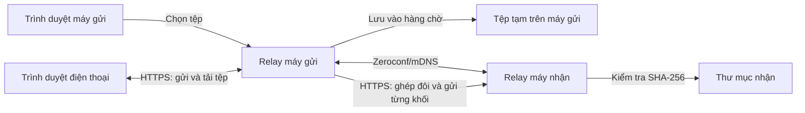

# Relay — truyền tệp trực tiếp trong mạng nội bộ

Relay là ứng dụng Python có giao diện web, cho phép chuyển tệp giữa hai máy Windows hoặc giữa một máy Windows và điện thoại trong cùng mạng Wi-Fi/Ethernet. Máy Windows chạy dịch vụ Relay; điện thoại chỉ cần trình duyệt. Dữ liệu đi qua kết nối HTTPS trong mạng nội bộ, không cần tài khoản, máy chủ đám mây hoặc Internet trong lúc truyền.

## Thông tin dự án

| Nội dung | Mô tả |
| --- | --- |
| Bài toán | Chuyển tệp và thư mục giữa các máy trong cùng mạng nội bộ, đồng thời theo dõi tiến độ và kiểm tra tệp sau khi nhận. |
| Đầu vào | Tệp/thư mục được chọn trên máy Windows hoặc tệp được chọn trên điện thoại; thiết bị nhận và mã ghép đôi/liên kết QR tương ứng. |
| Đầu ra | Tệp trong thư mục nhận của máy Windows hoặc tệp do trình duyệt điện thoại tải về; trạng thái và tiến độ trên giao diện tương ứng. |
| Nền tảng | Máy chạy Relay: Windows và Python 3.11 trở lên. Máy truy cập: trình duyệt trên Windows, Android hoặc iPhone. |
| Dữ liệu huấn luyện | Không áp dụng. Dự án không sử dụng mô hình học máy. |

## Chạy nhanh

Chạy các lệnh sau trên **mỗi máy Windows tham gia truyền tệp**. Nếu dùng điện thoại, chỉ cần chạy Relay trên máy Windows; điện thoại không cần cài Python. Mở PowerShell tại thư mục chứa dự án:

```powershell
py -3.11 --version
py -3.11 -m venv .venv
.\.venv\Scripts\python.exe -m pip install -e .
.\.venv\Scripts\python.exe -m relay
```

Nếu dùng Python 3.12 trở lên, thay `-3.11` ở hai dòng đầu bằng phiên bản tương ứng. Nếu máy không có lệnh `py`, dùng `python --version` để kiểm tra phiên bản từ **3.11** trở lên và thay lệnh tạo môi trường bằng `python -m venv .venv`.

Relay tự mở giao diện tại `https://127.0.0.1:8765`. Nếu cổng này bận, địa chỉ thực tế sẽ được in trong PowerShell; chương trình thử tối đa 19 cổng tiếp theo. Giữ cửa sổ PowerShell mở trong lúc sử dụng và nhấn `Ctrl+C` để dừng.

Cấu hình, chứng chỉ cục bộ và trạng thái truyền được lưu trong `%LOCALAPPDATA%\Relay`. Tệp nhận mặc định nằm ở `%USERPROFILE%\Downloads\Relay` và có thể đổi trên giao diện.

> **Lưu ý HTTPS:** Relay tự tạo chứng chỉ cho từng máy nên trình duyệt có thể cảnh báo ở lần mở đầu tiên. Trên máy tính, chỉ tiếp tục khi địa chỉ là `https://127.0.0.1:<cổng>` và chính bạn vừa chạy Relay. Trang điện thoại dùng địa chỉ IP nội bộ được tạo bằng nút **Tạo mã QR cho điện thoại**; chỉ tiếp tục sau khi kiểm tra IP đó là máy tính của mình. Giao diện quản lý máy tính vẫn chỉ truy cập được tại `localhost`.

## Chức năng chính

- **Tìm thiết bị:** quảng bá và phát hiện máy chạy Relay trong cùng mạng bằng Zeroconf/mDNS.
- **Ghép đôi:** máy nhận tạo mã 8 ký tự hoặc mã QR; mã có hiệu lực 10 phút và chỉ dùng một lần.
- **Chọn dữ liệu:** chọn nhiều tệp, chọn thư mục hoặc kéo thả tệp vào giao diện. Các tệp được đưa vào hàng chờ trên máy gửi trước khi truyền.
- **Truyền và theo dõi giữa hai máy Windows:** gửi tệp theo từng khối qua HTTPS; hiển thị tiến độ, tốc độ và trạng thái ở mục **Đã gửi** và **Đã nhận**.
- **Kiểm tra dữ liệu giữa hai máy Windows:** so sánh SHA-256 sau khi nhận; chỉ hoàn tất tệp khi kích thước và mã băm khớp với thông tin gửi đi.
- **Xử lý gián đoạn:** thử lại khối truyền khi có lỗi mạng; lưu trạng thái và dữ liệu đã đưa vào hàng chờ để người gửi có thể tiếp tục sau khi khởi động lại.
- **Tránh trùng tên:** tạo thư mục nhận riêng cho mỗi lượt truyền, kể cả khi gửi lại cùng tên.
- **Kết nối điện thoại:** tạo liên kết QR dùng một lần để điện thoại gửi tệp vào máy Windows hoặc tải các tệp trong hàng chờ của máy Windows về điện thoại. Tệp mới nhận hiển thị trong **Tệp từ điện thoại** trên máy tính, kèm đường dẫn để sao chép; lịch sử được lưu qua lần khởi động lại.

## Công nghệ sử dụng

| Thành phần | Công nghệ | Vai trò |
| --- | --- | --- |
| Dịch vụ và API | Python, FastAPI, Uvicorn | Cung cấp giao diện cục bộ và các API ghép đôi, truyền tệp. |
| Giao diện | HTML, CSS, JavaScript, Jinja2 | Chọn dữ liệu, ghép đôi và theo dõi tiến độ trong trình duyệt. |
| Khám phá thiết bị | Zeroconf/mDNS | Tìm các máy Relay trong mạng nội bộ. |
| Kết nối giữa hai máy | HTTPX, HTTPS | Gửi yêu cầu và các khối dữ liệu tới máy nhận. |
| Bảo mật và mã QR | cryptography, qrcode, Pillow | Tạo chứng chỉ, kiểm tra danh tính thiết bị và tạo mã QR ghép đôi. |

Các thư viện và phiên bản tối thiểu được khai báo trong [`pyproject.toml`](pyproject.toml).

## Hướng dẫn sử dụng và kịch bản demo

1. Kết nối hai máy Windows vào cùng mạng Wi-Fi hoặc Ethernet. Nếu Windows Firewall hỏi quyền truy cập, cho phép Relay trên mạng **Private**.
2. Chạy Relay trên cả hai máy. Kiểm tra tên máy trong phần **Kết nối máy tính**. Trên máy nhận, có thể đổi nơi lưu tệp tại **Thư mục lưu tệp nhận**; mặc định là `Downloads\Relay` trong thư mục người dùng.
3. Trên máy nhận, chọn **Tạo mã để máy khác kết nối vào đây**.
4. Trên máy gửi, nhập mã 8 ký tự và chọn **Kết nối**. Có thể dùng **Quét mã QR ghép nối** nếu trình duyệt hỗ trợ `BarcodeDetector` và có camera. Sau đó chọn thiết bị đã ghép đôi.
5. Chọn **Chọn tệp** hoặc **Chọn thư mục**. Đợi các tệp xuất hiện trong **Tệp đã chọn**, rồi chọn **Gửi đến [tên máy]**.
6. Theo dõi hai cột **Đã gửi** và **Đã nhận**. Khi hoàn tất, mở thư mục nhận để kiểm tra tên và nội dung tệp. Thử gửi lại cùng tên để quan sát thư mục nhận mới.
7. Để minh họa khôi phục, bắt đầu gửi một tệp lớn rồi dừng Relay giữa chừng. Khởi chạy lại cả hai bên nếu cần, tạo mã mới trên máy nhận, ghép đôi lại trên máy gửi và chọn **Thử gửi lại**.

Nếu không thấy máy bên kia, kiểm tra hai máy có cùng mạng, mạng Windows đang ở chế độ **Private** và Firewall cho phép kết nối. Mã nhập thủ công cần mDNS để tìm máy nhận. Mã QR có kèm địa chỉ thiết bị, nên có thể ghép đôi khi mDNS bị chặn nhưng hai máy vẫn kết nối trực tiếp được. Nếu trình duyệt không quét được QR, dùng mã thủ công sau khi khắc phục vấn đề tìm thiết bị.

## Dùng với điện thoại

1. Cho máy Windows và điện thoại vào cùng mạng Wi-Fi. Chạy Relay trên máy Windows, cho phép kết nối qua Windows Firewall trên mạng **Private** và mở giao diện `https://127.0.0.1:<cổng>` trên chính máy đó.
2. Trên giao diện máy tính, chọn **Tạo mã QR cho điện thoại**. Dùng camera của điện thoại quét mã QR hoặc mở liên kết hiện bên dưới mã. Liên kết có hiệu lực **10 phút** và chỉ dùng **một lần**.
3. Trên điện thoại, kiểm tra địa chỉ IP trong liên kết là IP của máy Windows rồi chọn **Kết nối với Relay**. Phiên kết nối có hiệu lực tối đa **1 giờ**. Nếu trình duyệt cảnh báo chứng chỉ tự tạo, chỉ tiếp tục khi đang kết nối tới đúng máy của mình.
4. **Điện thoại → máy tính:** chọn tệp/ảnh trong phần **Chọn ảnh hoặc tệp**, rồi chọn **Gửi đến máy tính**. Điện thoại xác nhận tên thư mục sau khi gửi. Trên máy tính, xem khu vực **Tệp từ điện thoại**: tệp mới nhận hiện ở đầu danh sách cùng đường dẫn đầy đủ và nút **Sao chép đường dẫn**. Dán đường dẫn đó vào File Explorer để mở tệp. Có thể chọn **Bật thông báo trên máy tính** để nhận thông báo của trình duyệt khi tab Relay đang ở nền. Mỗi lần kết nối được lưu vào một thư mục `From phone`, `From phone (2)`, ... trong thư mục nhận; tệp trùng tên cũng được đổi tên để giữ cả hai bản.
5. **Máy tính → điện thoại:** chọn tệp bằng **Chọn tệp** trên máy tính và chờ tệp xuất hiện ở **Tệp đã chọn**. Trên điện thoại, chọn **Làm mới danh sách** rồi **Tải về** từng tệp. Không cần chọn **Gửi đến [tên máy]** cho cách truyền này. Tệp đã tải về vẫn ở hàng chờ của máy tính cho đến khi được xóa hoặc dùng trong lượt truyền khác.
6. Khi xong, chọn **Ngắt kết nối điện thoại** trên máy tính để thu hồi phiên. Tạo liên kết mới nếu muốn kết nối lại.

Trang điện thoại chỉ chuyển **từng tệp**. Trình duyệt quyết định nơi lưu tệp tải xuống trên điện thoại. Nếu liên kết không mở được, kiểm tra hai thiết bị cùng mạng, IP trong mã QR và cài đặt Firewall; trang điện thoại không cần mDNS.

## Thiết kế và luồng xử lý



1. Trình duyệt chuyển tệp đã chọn vào hàng chờ cục bộ của Relay trên máy gửi.
2. Hai máy tìm thấy nhau qua mDNS hoặc dùng thông tin địa chỉ trong mã QR; người dùng ghép đôi bằng mã dùng một lần.
3. Máy gửi lập danh sách tệp, kích thước và SHA-256, rồi truyền dữ liệu qua HTTPS theo từng khối.
4. Máy nhận ghi dữ liệu tạm, xác nhận kích thước và SHA-256, sau đó đưa tệp hoàn chỉnh vào thư mục nhận. Tiến độ được cập nhật trên giao diện hai máy.

| Vị trí trong mã nguồn | Trách nhiệm |
| --- | --- |
| `relay/__main__.py` | Khởi động dịch vụ, chọn cổng và mở trình duyệt. |
| `relay/app.py` | API và giao diện FastAPI; giới hạn thao tác điều khiển vào máy cục bộ. |
| `relay/discovery.py` | Quảng bá và tìm thiết bị bằng Zeroconf/mDNS. |
| `relay/security.py`, `relay/network.py` | Mã ghép đôi, phiên kết nối và kiểm tra chứng chỉ theo fingerprint. |
| `relay/transfers.py` | Hàng chờ, truyền theo khối, kiểm tra SHA-256, thử lại và lưu trạng thái. |
| `relay/phone.py` | Liên kết QR dùng một lần, phiên điện thoại và xử lý tệp điện thoại gửi lên. |
| `relay/templates/`, `relay/static/` | Giao diện HTML, CSS và JavaScript. |
| `tests/` | Kiểm thử tự động cho các thành phần chính. |

## Bảo mật và toàn vẹn dữ liệu

- Giao diện và API điều khiển chỉ nhận truy cập từ `localhost`; thao tác thay đổi dữ liệu cần token của phiên giao diện.
- Kết nối giữa hai máy sử dụng HTTPS. Relay kiểm tra fingerprint chứng chỉ của thiết bị được ghép đôi trước khi truyền.
- API nhận tệp yêu cầu phiên ghép đôi còn hiệu lực; mã ghép đôi chỉ dùng một lần và không được trả về cho máy khác trong mạng.
- Đường dẫn tệp nhận được kiểm tra để không ghi ra ngoài thư mục đích. Với truyền giữa hai máy Windows, tệp chỉ được hoàn tất sau khi SHA-256 khớp.
- Trang điện thoại cần liên kết QR dùng một lần; phiên được giữ bằng cookie bảo mật và thao tác tải lên cần thêm token. Người dùng có thể thu hồi phiên từ máy tính.

## Kiểm thử

Cài thêm công cụ phát triển và chạy bộ kiểm thử:

```powershell
.\.venv\Scripts\python.exe -m pip install -e ".[dev]"
.\.venv\Scripts\python.exe -m pytest -q
.\.venv\Scripts\python.exe -m ruff check .
.\.venv\Scripts\python.exe -m mypy relay tests
```

Bộ kiểm thử tự động bao gồm kiểm tra đường dẫn an toàn, mã ghép đôi dùng một lần, xử lý gián đoạn và khôi phục truyền tệp, quyền truy cập API, khám phá thiết bị, kết nối điện thoại/tải lên/tải xuống và một kịch bản truyền tệp qua HTTPS trên loopback. Khi bảo vệ bài tập lớn, nên demo trên **hai thiết bị thật** để kiểm tra thêm Firewall, mDNS và kết nối mạng thực tế; bộ kiểm thử trên một máy không thay thế được bước này.

Kết quả kiểm tra trên môi trường Python 3.11: **28 bài kiểm thử đạt**, Ruff không báo lỗi và mypy không tìm thấy lỗi trong mã nguồn. Pytest có một cảnh báo về tương thích giữa các thư viện kiểm thử, không làm bài kiểm thử thất bại.

## Giới hạn hiện tại

- Sau khi Relay khởi động lại, phiên ghép đôi không được lưu. Người gửi phải ghép đôi lại và chọn **Thử gửi lại**; ứng dụng không tự tiếp tục truyền.
- Các tệp đã vào hàng chờ hoàn chỉnh được giữ lại. Nếu Relay dừng khi trình duyệt vẫn đang tải một tệp vào hàng chờ, cần chọn lại tệp đó.
- Khi chọn thư mục, trình duyệt chỉ cung cấp các tệp bên trong; thư mục rỗng không được truyền.
- Trang điện thoại chỉ gửi/tải tệp riêng lẻ, chưa chuyển cả thư mục hoặc tự đồng bộ. Phiên điện thoại mất khi Relay khởi động lại. Chưa kiểm thử thủ công trên thiết bị Android/iPhone thật.
- Ứng dụng chưa có bộ cài Windows và chưa chạy nền như dịch vụ hệ thống.

## Mã nguồn

Mã nguồn dự án: [github.com/doletrandat/filetransfer6969](https://github.com/doletrandat/filetransfer6969).
