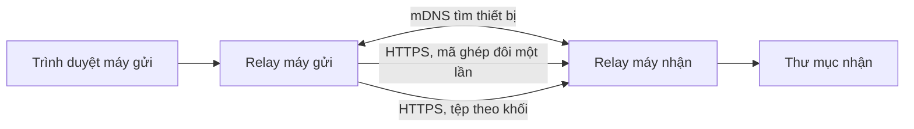

# Relay — chuyển tệp trực tiếp trong mạng nội bộ

Relay là bài tập lớn về truyền tệp giữa hai máy Windows trong cùng mạng Wi-Fi hoặc Ethernet. Ứng dụng chạy một dịch vụ Python trên mỗi máy và mở giao diện trong trình duyệt. Tệp đi trực tiếp giữa hai máy, không qua tài khoản hay máy chủ đám mây.

## Chức năng

- Tìm thiết bị bằng Zeroconf/mDNS; ghép đôi bằng mã 8 ký tự hoặc QR.
- Chọn nhiều tệp hoặc cả thư mục, theo dõi tiến trình gửi và nhận.
- Truyền theo từng khối, thử lại khi lỗi mạng và xác nhận SHA-256 trước khi hoàn tất tệp.
- Tạo thư mục nhận riêng cho mỗi lượt truyền để tránh trùng tên.
- Giữ tệp đã chọn và trạng thái nhận sau khi khởi động lại. Người gửi cần ghép đôi lại rồi bấm **Retry remaining files** để tiếp tục lượt truyền dang dở.

## Yêu cầu

- Hai máy **Windows** cùng mạng nội bộ, Python **3.11 trở lên**.
- Cho phép Relay qua Windows Firewall trên mạng **Private**. Cổng mặc định là `8765`; nếu bận, Relay thử 19 cổng kế tiếp.
- Trình duyệt hiện đại. Nếu trình duyệt không hỗ trợ quét QR bằng `BarcodeDetector` hoặc máy không có camera, nhập mã ghép đôi thủ công.

## Cài đặt và chạy trên mỗi máy

Mở PowerShell tại thư mục project:

```powershell
py -3.11 -m venv .venv
.\.venv\Scripts\python.exe -m pip install -e .
.\.venv\Scripts\python.exe -m relay
```

Nếu chỉ có một phiên bản Python 3.11+ và lệnh `py -3.11` không hoạt động, thay dòng đầu bằng `python -m venv .venv`.

Giao diện tự mở tại `https://127.0.0.1:8765` (hoặc cổng thực tế in trong PowerShell). Chứng chỉ HTTPS do từng máy tự tạo nên trình duyệt có thể hiện cảnh báo lần đầu; chỉ tiếp tục khi địa chỉ là `127.0.0.1` và bạn đang chạy Relay trên chính máy đó. Không mở giao diện bằng địa chỉ IP LAN: API điều khiển chỉ cho phép truy cập từ máy cục bộ.

Thư mục nhận mặc định là `Downloads\Relay`. Có thể đổi tại **Receive folder**. Relay lưu cấu hình và trạng thái trong `%LOCALAPPDATA%\Relay`.

## Demo hai máy

1. Khởi chạy Relay trên cả hai máy và kiểm tra tên máy ở **Nearby devices**.
2. Trên máy nhận, bấm **Receive from another device**. Mã hiện ra có hiệu lực 10 phút và dùng một lần.
3. Trên máy gửi, nhập mã của máy nhận hoặc quét QR. Chọn thiết bị vừa ghép đôi.
4. Chọn tệp hoặc thư mục, bấm **Open transfer route** và theo dõi cột **Outgoing**/**Incoming**.
5. Mở thư mục nhận, đối chiếu tên thư mục và nội dung tệp. Thử gửi cùng tên lần nữa để thấy Relay tạo thư mục mới.
6. Để demo phục hồi: bắt đầu truyền một tệp lớn, dừng Relay trên một máy, chạy lại, ghép đôi lại và bấm **Retry remaining files** trên máy gửi.

Máy trong mạng có thể không xuất hiện nếu mDNS bị chặn. Khi đó giữ cả hai máy trong cùng mạng Private và kiểm tra Firewall; ghép đôi QR cung cấp địa chỉ trực tiếp nếu hai máy vẫn kết nối được. Mã nhập thủ công cần có thông tin khám phá mDNS.

## Kiến trúc



| Thành phần | Vai trò |
| --- | --- |
| `relay/app.py` | FastAPI, giao diện và API; giới hạn API điều khiển vào máy cục bộ. |
| `relay/discovery.py` | Quảng bá và tìm thiết bị qua Zeroconf/mDNS. |
| `relay/security.py`, `relay/network.py` | Mã ghép đôi, phiên truyền và kiểm tra chứng chỉ TLS theo fingerprint. |
| `relay/transfers.py` | Staging, manifest, truyền khối, SHA-256, thử lại và lưu trạng thái. |
| `relay/static/`, `relay/templates/` | Giao diện HTML/CSS/JavaScript. |

API điều khiển cục bộ yêu cầu kết nối từ loopback và token ngẫu nhiên của phiên giao diện cho thao tác thay đổi dữ liệu. API giữa hai máy chỉ nhận kết nối HTTPS, kiểm tra fingerprint chứng chỉ và yêu cầu phiên ghép đôi cho việc truyền tệp. Mã ghép đôi không được trả về cho máy khác trong mạng.

## Kiểm thử

```powershell
.\.venv\Scripts\python.exe -m pip install -e ".[dev]"
.\.venv\Scripts\python.exe -m pytest -q
.\.venv\Scripts\python.exe -m ruff check .
.\.venv\Scripts\python.exe -m mypy relay tests
```

Bộ test gồm kiểm tra đường dẫn an toàn, mã dùng một lần, khôi phục truyền tệp, quyền truy cập API và một ca ghép đôi/truyền tệp qua HTTPS trên loopback. Cần chạy demo trên **hai máy thật** trước khi nộp để kiểm tra Firewall, mDNS và tốc độ mạng thực tế.

## Giới hạn hiện tại

- Sau khi khởi động lại, cần ghép đôi lại; phiên ghép đôi không được lưu xuống đĩa. Giao diện đánh dấu lượt gửi cũ là cần thử lại.
- Tệp đã đưa hoàn chỉnh vào hàng chờ được giữ lại. Nếu trình duyệt đang **tải tệp vào hàng chờ** và Relay dừng giữa chừng, cần chọn lại tệp đó.
- Project chưa có bộ cài Windows hay chạy nền như một dịch vụ. Các lựa chọn phân phối được ghi trong [PRODUCT.md](PRODUCT.md).

## Gợi ý trình bày bài tập lớn

Trong báo cáo, nên bổ sung tên thành viên và phần việc thực tế của từng người, ảnh demo hai máy, sơ đồ ở trên, kết quả kiểm thử và giới hạn đã biết. Không nên mô tả việc tiếp tục truyền là tự động: sau khi khởi động lại, người dùng phải ghép đôi và bấm thử lại.
