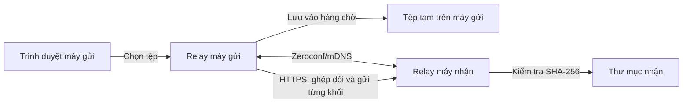

# Relay — truyền tệp trực tiếp trong mạng nội bộ

Relay là ứng dụng Python có giao diện web, cho phép chuyển tệp giữa hai máy Windows trong cùng mạng Wi-Fi hoặc Ethernet. Mỗi máy chạy một dịch vụ Relay; dữ liệu được gửi trực tiếp qua kết nối HTTPS giữa hai máy, không cần tài khoản, máy chủ đám mây hoặc Internet trong lúc truyền.

## Thông tin dự án

| Nội dung | Mô tả |
| --- | --- |
| Bài toán | Chuyển tệp và thư mục giữa các máy trong cùng mạng nội bộ, đồng thời theo dõi tiến độ và kiểm tra tệp sau khi nhận. |
| Đầu vào | Một hoặc nhiều tệp, các tệp trong thư mục được chọn, thiết bị nhận và mã ghép đôi hoặc mã QR. |
| Đầu ra | Tệp trên máy nhận, được sắp xếp trong thư mục riêng cho mỗi lượt truyền; trạng thái và tiến độ gửi/nhận trên giao diện. |
| Nền tảng | Windows, Python 3.11 trở lên, trình duyệt hiện đại. |
| Dữ liệu huấn luyện | Không áp dụng. Dự án không sử dụng mô hình học máy. |

## Chạy nhanh

Thực hiện trên **cả hai máy Windows** trong cùng mạng. Mở PowerShell tại thư mục chứa dự án:

```powershell
py -3.11 --version
py -3.11 -m venv .venv
.\.venv\Scripts\python.exe -m pip install -e .
.\.venv\Scripts\python.exe -m relay
```

Nếu dùng Python 3.12 trở lên, thay `-3.11` ở hai dòng đầu bằng phiên bản tương ứng. Nếu máy không có lệnh `py`, dùng `python --version` để kiểm tra phiên bản từ **3.11** trở lên và thay lệnh tạo môi trường bằng `python -m venv .venv`.

Relay tự mở giao diện tại `https://127.0.0.1:8765`. Nếu cổng này bận, địa chỉ thực tế sẽ được in trong PowerShell; chương trình thử tối đa 19 cổng tiếp theo. Giữ cửa sổ PowerShell mở trong lúc sử dụng và nhấn `Ctrl+C` để dừng.

Cấu hình, chứng chỉ cục bộ và trạng thái truyền được lưu trong `%LOCALAPPDATA%\Relay`. Tệp nhận mặc định nằm ở `%USERPROFILE%\Downloads\Relay` và có thể đổi trên giao diện.

> **Lưu ý HTTPS:** Relay tự tạo chứng chỉ cho từng máy nên trình duyệt có thể cảnh báo ở lần mở đầu tiên. Chỉ tiếp tục khi địa chỉ là `https://127.0.0.1:<cổng>` và chính bạn vừa chạy Relay trên máy đó. Giao diện điều khiển chỉ cho phép truy cập từ máy cục bộ; không mở giao diện bằng địa chỉ IP của máy trong mạng LAN.

## Chức năng chính

- **Tìm thiết bị:** quảng bá và phát hiện máy chạy Relay trong cùng mạng bằng Zeroconf/mDNS.
- **Ghép đôi:** máy nhận tạo mã 8 ký tự hoặc mã QR; mã có hiệu lực 10 phút và chỉ dùng một lần.
- **Chọn dữ liệu:** chọn nhiều tệp, chọn thư mục hoặc kéo thả tệp vào giao diện. Các tệp được đưa vào hàng chờ trên máy gửi trước khi truyền.
- **Truyền và theo dõi:** gửi tệp theo từng khối qua HTTPS; hiển thị tiến độ, tốc độ và trạng thái ở mục **Outgoing** và **Incoming**.
- **Kiểm tra dữ liệu:** so sánh SHA-256 sau khi nhận; chỉ hoàn tất tệp khi kích thước và mã băm khớp với thông tin gửi đi.
- **Xử lý gián đoạn:** thử lại khối truyền khi có lỗi mạng; lưu trạng thái và dữ liệu đã đưa vào hàng chờ để người gửi có thể tiếp tục sau khi khởi động lại.
- **Tránh trùng tên:** tạo thư mục nhận riêng cho mỗi lượt truyền, kể cả khi gửi lại cùng tên.

## Công nghệ sử dụng

| Thành phần | Công nghệ | Vai trò |
| --- | --- | --- |
| Dịch vụ và API | Python, FastAPI, Uvicorn | Cung cấp giao diện cục bộ và các API ghép đôi, truyền tệp. |
| Giao diện | HTML, CSS, JavaScript, Jinja2 | Chọn dữ liệu, ghép đôi và theo dõi tiến độ trong trình duyệt. |
| Khám phá thiết bị | Zeroconf/mDNS | Tìm các máy Relay trong mạng nội bộ. |
| Kết nối giữa hai máy | HTTPX, HTTPS | Gửi yêu cầu và các khối dữ liệu tới máy nhận. |
| Bảo mật và mã QR | cryptography, qrcode, Pillow | Tạo chứng chỉ, kiểm tra danh tính thiết bị và tạo mã QR ghép đôi. |

Các thư viện và phiên bản tối thiểu được khai báo trong [`pyproject.toml`](pyproject.toml).

## Hướng dẫn sử dụng và kịch bản demo

1. Kết nối hai máy Windows vào cùng mạng Wi-Fi hoặc Ethernet. Nếu Windows Firewall hỏi quyền truy cập, cho phép Relay trên mạng **Private**.
2. Chạy Relay trên cả hai máy. Kiểm tra tên máy trong phần **Nearby devices**. Trên máy nhận, có thể đổi nơi lưu tệp tại **Receive folder**; mặc định là `Downloads\Relay` trong thư mục người dùng.
3. Trên máy nhận, chọn **Receive from another device** để tạo mã ghép đôi.
4. Trên máy gửi, nhập mã vào **Enter the code shown on the other device** và chọn **Authorize device**. Có thể dùng **Scan a pairing QR instead** nếu trình duyệt hỗ trợ `BarcodeDetector` và có camera. Sau đó chọn thiết bị đã ghép đôi.
5. Chọn **Choose files** hoặc **Choose folder**. Đợi các tệp xuất hiện trong **Ready to send**, rồi chọn **Open transfer route**.
6. Theo dõi hai cột **Outgoing** và **Incoming**. Khi hoàn tất, mở thư mục nhận để kiểm tra tên và nội dung tệp. Thử gửi lại cùng tên để quan sát thư mục nhận mới.
7. Để minh họa khôi phục, bắt đầu gửi một tệp lớn rồi dừng Relay giữa chừng. Khởi chạy lại cả hai bên nếu cần, tạo mã mới trên máy nhận, ghép đôi lại trên máy gửi và chọn **Retry remaining files**.

Nếu không thấy máy bên kia, kiểm tra hai máy có cùng mạng, mạng Windows đang ở chế độ **Private** và Firewall cho phép kết nối. Mã nhập thủ công cần mDNS để tìm máy nhận. Mã QR có kèm địa chỉ thiết bị, nên có thể ghép đôi khi mDNS bị chặn nhưng hai máy vẫn kết nối trực tiếp được. Nếu trình duyệt không quét được QR, dùng mã thủ công sau khi khắc phục vấn đề tìm thiết bị.

## Thiết kế và luồng xử lý



1. Trình duyệt chuyển tệp đã chọn vào hàng chờ cục bộ của Relay trên máy gửi.
2. Hai máy tìm thấy nhau qua mDNS hoặc dùng thông tin địa chỉ trong mã QR; người dùng ghép đôi bằng mã dùng một lần.
3. Máy gửi lập danh sách tệp, kích thước và SHA-256, rồi truyền dữ liệu qua HTTPS theo từng khối.
4. Máy nhận ghi dữ liệu tạm, xác nhận kích thước và SHA-256, sau đó đưa tệp hoàn chỉnh vào thư mục nhận. Tiến độ được cập nhật trên giao diện hai máy.

| Vị trí trong mã nguồn | Trách nhiệm |
| --- | --- |
| `relay/__main__.py` | Khởi động dịch vụ, chọn cổng và mở trình duyệt. |
| `relay/app.py` | API và giao diện FastAPI; giới hạn thao tác điều khiển vào máy cục bộ. |
| `relay/discovery.py` | Quảng bá và tìm thiết bị bằng Zeroconf/mDNS. |
| `relay/security.py`, `relay/network.py` | Mã ghép đôi, phiên kết nối và kiểm tra chứng chỉ theo fingerprint. |
| `relay/transfers.py` | Hàng chờ, truyền theo khối, kiểm tra SHA-256, thử lại và lưu trạng thái. |
| `relay/templates/`, `relay/static/` | Giao diện HTML, CSS và JavaScript. |
| `tests/` | Kiểm thử tự động cho các thành phần chính. |

## Bảo mật và toàn vẹn dữ liệu

- Giao diện và API điều khiển chỉ nhận truy cập từ `localhost`; thao tác thay đổi dữ liệu cần token của phiên giao diện.
- Kết nối giữa hai máy sử dụng HTTPS. Relay kiểm tra fingerprint chứng chỉ của thiết bị được ghép đôi trước khi truyền.
- API nhận tệp yêu cầu phiên ghép đôi còn hiệu lực; mã ghép đôi chỉ dùng một lần và không được trả về cho máy khác trong mạng.
- Đường dẫn tệp nhận được kiểm tra để không ghi ra ngoài thư mục đích. Tệp chỉ được hoàn tất sau khi SHA-256 khớp.

## Kiểm thử

Cài thêm công cụ phát triển và chạy bộ kiểm thử:

```powershell
.\.venv\Scripts\python.exe -m pip install -e ".[dev]"
.\.venv\Scripts\python.exe -m pytest -q
.\.venv\Scripts\python.exe -m ruff check .
.\.venv\Scripts\python.exe -m mypy relay tests
```

Bộ kiểm thử tự động bao gồm kiểm tra đường dẫn an toàn, mã ghép đôi dùng một lần, xử lý gián đoạn và khôi phục truyền tệp, quyền truy cập API, khám phá thiết bị và một kịch bản ghép đôi/truyền tệp qua HTTPS trên loopback. Khi bảo vệ bài tập lớn, nên demo trên **hai máy thật** để kiểm tra thêm Firewall, mDNS và kết nối mạng thực tế; bộ kiểm thử trên một máy không thay thế được bước này.

Kết quả kiểm tra trên môi trường Python 3.11: **24 bài kiểm thử đạt**, Ruff không báo lỗi và mypy không tìm thấy lỗi trong 16 tệp mã nguồn. Pytest có một cảnh báo về tương thích giữa các thư viện kiểm thử, không làm bài kiểm thử thất bại.

## Giới hạn hiện tại

- Sau khi Relay khởi động lại, phiên ghép đôi không được lưu. Người gửi phải ghép đôi lại và chọn **Retry remaining files**; ứng dụng không tự tiếp tục truyền.
- Các tệp đã vào hàng chờ hoàn chỉnh được giữ lại. Nếu Relay dừng khi trình duyệt vẫn đang tải một tệp vào hàng chờ, cần chọn lại tệp đó.
- Khi chọn thư mục, trình duyệt chỉ cung cấp các tệp bên trong; thư mục rỗng không được truyền.
- Ứng dụng chưa có bộ cài Windows và chưa chạy nền như dịch vụ hệ thống. Giao diện hiện dùng tiếng Anh.

## Mã nguồn

Mã nguồn dự án: [github.com/doletrandat/filetransfer6969](https://github.com/doletrandat/filetransfer6969).
