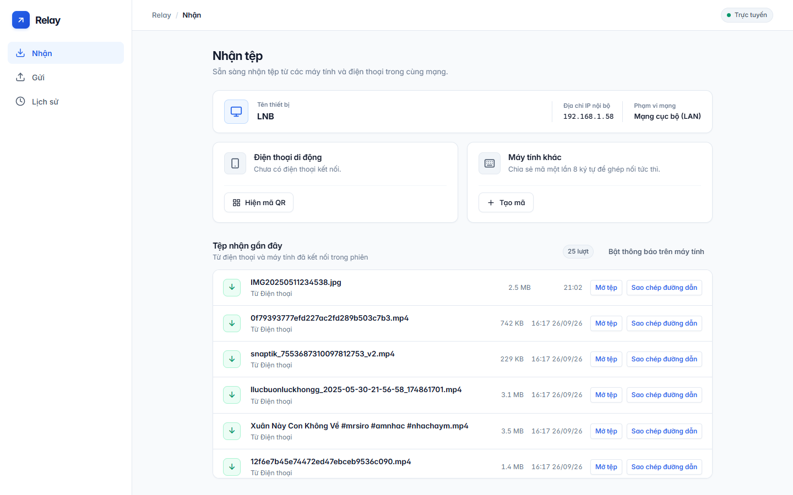
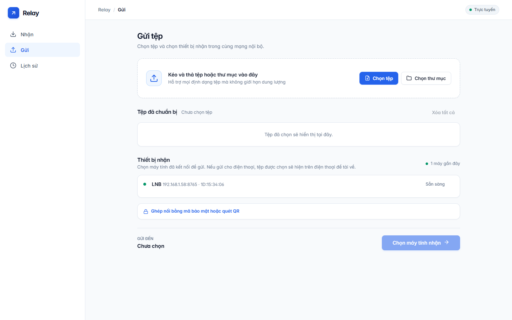
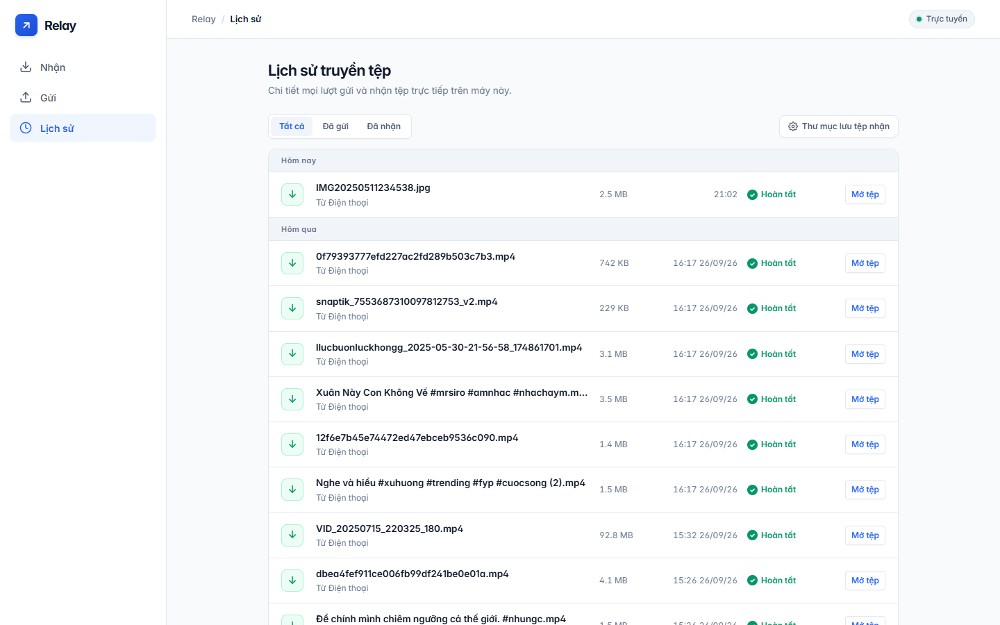
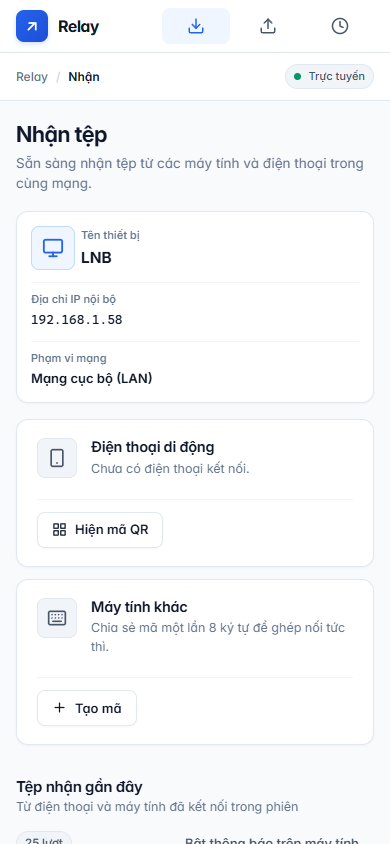
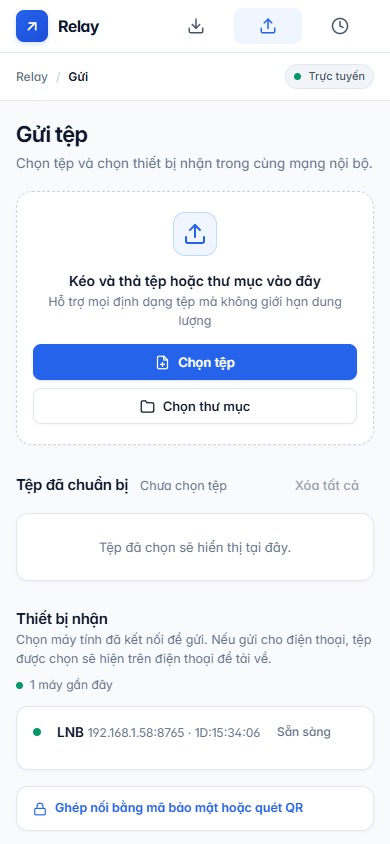
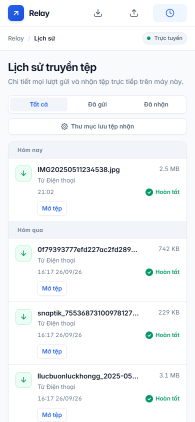
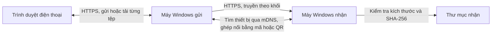

# Relay — truyền tệp trực tiếp trong mạng nội bộ

**Relay** giúp gửi tệp giữa hai máy Windows hoặc giữa máy Windows và điện thoại trong cùng mạng Wi-Fi/Ethernet. Hai máy tính chạy Relay có thể tìm và ghép nối với nhau; điện thoại chỉ cần trình duyệt và mã QR. Tệp đi trực tiếp qua mạng nội bộ bằng HTTPS, không cần tài khoản hay dịch vụ đám mây.

> **Phạm vi:** máy chạy Relay cần Windows và Python 3.11 trở lên. Android/iPhone dùng trình duyệt để kết nối với một máy Windows đang chạy Relay.

## Giao diện

Ba màn hình chính trên máy tính:

### Nhận tệp

Xem tên và địa chỉ IP nội bộ của máy, tạo mã ghép nối cho máy tính khác, hiện QR cho điện thoại và mở tệp vừa nhận.



### Gửi tệp

Kéo thả hoặc chọn tệp/thư mục, chọn máy nhận đã ghép nối rồi theo dõi quá trình gửi.



### Lịch sử

Lọc các lượt đã gửi/đã nhận, xem trạng thái, mở tệp hoàn tất và đổi thư mục lưu tệp nhận.



<details>
<summary><strong>Xem bố cục khi cửa sổ trình duyệt hẹp</strong></summary>

| Nhận | Gửi | Lịch sử |
| :---: | :---: | :---: |
|  |  |  |

Các ảnh này minh họa cách **giao diện quản lý Relay** co giãn theo chiều rộng cửa sổ. Trang kết nối dành riêng cho điện thoại có luồng gửi/tải tệp riêng.

</details>

## Cài đặt và chạy

Mở PowerShell trong thư mục dự án. Thực hiện trên **mỗi máy Windows** muốn tham gia truyền tệp:

```powershell
py -3.11 -m venv .venv
.\.venv\Scripts\python.exe -m pip install -e .
.\.venv\Scripts\python.exe -m relay
```

Yêu cầu Python **3.11 trở lên**. Nếu dùng phiên bản khác, đổi `-3.11` tương ứng; nếu không có lệnh `py`, dùng `python -m venv .venv`. Điện thoại không cần cài Relay hay Python.

Relay tự mở `https://127.0.0.1:8765` trên máy đang chạy. Nếu cổng 8765 bận, xem địa chỉ thực tế trong PowerShell. Giữ cửa sổ PowerShell mở khi sử dụng; nhấn `Ctrl+C` để dừng. Nếu Windows Firewall hỏi, cho phép Relay trên mạng **Private**.

Chứng chỉ HTTPS được tạo trên từng máy. Trình duyệt có thể cảnh báo ở lần đầu mở; chỉ tiếp tục sau khi kiểm tra đúng địa chỉ của máy mình. Trang quản lý chỉ truy cập từ chính máy chạy Relay tại `localhost`.

Sau khi đổi Wi-Fi hoặc được cấp IP mới, khởi động lại Relay trên cả hai máy. Khi khởi động, Relay tự cấp lại chứng chỉ nếu thiếu IP hiện tại hoặc sắp hết hạn, giữ nguyên mã định danh thiết bị và thư mục nhận. Tạo mã ghép nối mới để kết nối lại; trình duyệt có thể yêu cầu xác nhận chứng chỉ mới. Nếu gặp lỗi chứng chỉ không khớp IP, cần cập nhật Relay trên máy nhận nữa.

## Cách sử dụng

### Giữa hai máy Windows

1. Kết nối hai máy vào cùng mạng và chạy Relay trên cả hai.
2. Trên máy **nhận**, vào **Nhận** → **Tạo mã** để lấy mã ghép nối. Nhiều máy gửi có thể dùng cùng mã trong 10 phút và truyền tệp đồng thời, mỗi máy có phiên riêng.
3. Trên máy **gửi**, vào **Gửi** → **Ghép nối bằng mã bảo mật hoặc quét QR**. Nhập mã hoặc quét QR, sau đó chọn máy nhận.
4. Chọn **Chọn tệp**, **Chọn thư mục** hoặc kéo thả tệp vào vùng chọn. Khi danh sách tệp đã chuẩn bị hiện ra, bắt đầu gửi tới máy đã chọn.
5. Xem tiến độ và kết quả trong **Lịch sử** trên hai máy. Tệp nhận mặc định ở `%USERPROFILE%\Downloads\Relay`; có thể đổi tại **Lịch sử → Thư mục lưu tệp nhận**.

Relay dùng Zeroconf/mDNS để tìm máy trong mạng. Nếu không thấy máy nhận, kiểm tra hai máy cùng mạng, cấu hình mạng Windows là **Private** và quyền Firewall. Mã QR của máy tính chứa địa chỉ thiết bị, nên vẫn có thể ghép nối trực tiếp khi mDNS bị chặn nhưng hai máy còn kết nối được với nhau.

### Giữa máy Windows và điện thoại

1. Cho máy tính và điện thoại vào cùng mạng Wi-Fi. Trên máy tính, vào **Nhận** → **Hiện mã QR**.
2. Quét QR bằng điện thoại, kiểm tra địa chỉ IP trong liên kết là của máy tính mình rồi chọn **Kết nối với Relay**. Liên kết chỉ dùng một lần và hết hạn sau **10 phút**; phiên điện thoại kéo dài tối đa **1 giờ**.
3. **Điện thoại → máy tính:** trên trang điện thoại, chọn **Gửi lên máy tính**, chọn tệp và gửi. Tệp xuất hiện ở **Tệp nhận gần đây** và **Lịch sử** trên máy tính, trong thư mục `From phone` bên trong nơi lưu tệp nhận.
4. **Máy tính → điện thoại:** chọn tệp trên màn **Gửi** của máy tính. Trên điện thoại, vào **Tải về điện thoại** để mở hoặc tải tệp đã chuẩn bị. Không cần bấm nút gửi tới một máy tính khác.
5. Khi xong, chọn **Ngắt kết nối** trên máy tính để thu hồi phiên điện thoại.

Trình duyệt điện thoại quyết định nơi lưu tệp tải xuống. Nếu trang không mở được, kiểm tra hai thiết bị cùng mạng, IP trong QR, Firewall và cảnh báo chứng chỉ HTTPS. Trang điện thoại không cần mDNS.

## Cách Relay hoạt động


```mermaid
flowchart LR
    A[Máy Windows gửi] -->|HTTPS, truyền theo khối| B[Máy Windows nhận]
    A <-->|Tìm thiết bị qua mDNS, ghép nối bằng mã hoặc QR| B
    C[Trình duyệt điện thoại] <-->|HTTPS, gửi hoặc tải từng tệp| A
    B -->|Kiểm tra kích thước và SHA-256| D[Thư mục nhận]
```

- **Ghép nối:** mã máy tính gồm 8 ký tự, dùng được cho nhiều máy trong 10 phút. Mỗi máy được cấp phiên riêng; ngắt một máy không ảnh hưởng các máy khác. Tạo mã mới làm mã cũ mất hiệu lực nhưng giữ các phiên đã kết nối. Kết nối HTTPS giữa hai máy được kiểm tra theo fingerprint chứng chỉ đã ghép nối.
- **Toàn vẹn tệp:** truyền giữa hai máy Windows theo từng khối; chỉ đánh dấu hoàn tất khi kích thước và SHA-256 của tệp nhận khớp. Đường dẫn nhận được kiểm tra để không ghi ra ngoài thư mục đích.
- **Khôi phục:** Relay lưu trạng thái hàng chờ và phần tệp đã nhận. Sau khi khởi động lại, cần ghép nối lại rồi chọn thử gửi lại; ứng dụng chưa tự tiếp tục phiên gửi.
- **Quyền truy cập:** giao diện điều khiển chỉ mở trên `localhost`; trang điện thoại yêu cầu liên kết mời và phiên kết nối còn hiệu lực.

Mã nguồn chính nằm trong [`relay/app.py`](relay/app.py) (API và giao diện), [`relay/transfers.py`](relay/transfers.py) (hàng chờ và truyền tệp), [`relay/discovery.py`](relay/discovery.py) (tìm thiết bị), [`relay/security.py`](relay/security.py) (ghép nối) và [`relay/phone.py`](relay/phone.py) (kết nối điện thoại). Các phụ thuộc được khai báo trong [`pyproject.toml`](pyproject.toml).

## Kiểm thử

Sau khi tạo môi trường ảo, cài công cụ phát triển và chạy:

```powershell
.\.venv\Scripts\python.exe -m pip install -e ".[dev]"
.\.venv\Scripts\python.exe -m pytest -q
.\.venv\Scripts\python.exe -m ruff check .
.\.venv\Scripts\python.exe -m mypy relay tests
```

Bộ kiểm thử bao gồm đường dẫn tệp, ghép nối, truyền và khôi phục, API, khám phá thiết bị và luồng điện thoại. Kiểm thử tự động trên một máy không thay thế việc thử thực tế với hai thiết bị cùng mạng, đặc biệt với Firewall và mDNS.

## Giới hạn hiện tại

- Máy chạy dịch vụ Relay được hỗ trợ trên Windows; chưa có bộ cài hoặc chế độ chạy nền.
- Sau khi khởi động lại, cần ghép nối lại; tệp đang được trình duyệt đưa vào hàng chờ dở dang cần chọn lại.
- Thư mục rỗng không được truyền. Trang điện thoại chỉ gửi/tải từng tệp, chưa chuyển cả thư mục hoặc tự đồng bộ.
- Phiên điện thoại mất khi Relay khởi động lại. Chưa xác nhận thủ công toàn bộ luồng trên Android/iPhone thật.

Mã nguồn: [github.com/doletrandat/filetransfer6969](https://github.com/doletrandat/filetransfer6969).
